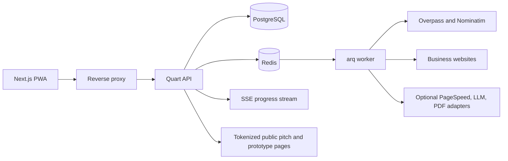

# LeadPitch architecture

## Architecture goals

LeadPitch is a multi-tenant, responsive web application for local-business
discovery and sales enablement. The architecture prioritizes:

- OSM-first discovery without a Google Cloud dependency.
- Explicit provider interfaces for maps, discovery, audits, generation, and
  artifact storage.
- Async processing for discovery, crawls, audits, PDFs, and prototypes.
- Strict workspace isolation and explainable outputs.
- A small local Docker footprint that can scale on a generic VPS.
- Accessible desktop, tablet, and phone experiences.

## System overview



The browser authenticates with a secure session cookie. A long-running request
creates a job, reserves credits transactionally, and returns a job ID. An arq
worker performs provider calls or crawling, stores normalized results and
progress, and publishes events through Redis. The API exposes those events over
SSE. The frontend updates the map, lead list, report, pitch, or prototype as
work completes.

## Component responsibilities

### Backend

Quart runs behind Hypercorn and is organized into:

- `auth` — registration, sessions, password flows, CSRF, and current-user
  context.
- `workspaces` — membership, invitations, RBAC, branding, plans, and credits.
- `discovery` — provider-neutral search, normalization, deduplication, refresh,
  imports, and map queries.
- `classification` — URL normalization, redirects, status checks, parked-page
  detection, and social-only classification.
- `audits` — bounded crawling, robots handling, rule registry, issues, and
  scores.
- `scoring` — severity, reasons, opportunity score, and lead-value tiers.
- `pitches` — recommendations, bilingual templates, branded pages, and PDFs.
- `prototypes` — versioned templates, preview, editing, and exports.
- `pipeline` — stages, assignments, reminders, activities, and reports.
- `developer` — API keys, rate limits, OpenAPI, exports, and webhooks.
- `jobs` — arq tasks, progress events, retries, idempotency, and cleanup.

SQLAlchemy 2 async repositories own database access. Services enforce business
rules and authorization before repositories are called. Pydantic or
quart-schema validates request and response contracts. Errors use one explicit
envelope; unexpected failures are logged and never converted into successful
fallback responses.

### Frontend

Next.js App Router with TypeScript and Tailwind provides:

- A tokenized light/dark design system with WCAG AA contrast.
- An application shell with auth and workspace context.
- A client-side map adapter isolated from business logic.
- A virtualized lead list synchronized with map pins and the detail drawer.
- URL-synchronized filters for shareable views.
- Skeleton, empty, error, and offline states.
- PWA manifest, icons, and app-shell service worker caching.
- GSAP ScrollTrigger and Lenis on marketing pages only. In-app motion is
  restrained and disabled or reduced under `prefers-reduced-motion`.

The map renderer is configured for an OSM-compatible provider and must show
attribution. A future Google adapter is possible without changing lead or
discovery contracts.

### Queue and cache

Redis provides the arq queue, short-lived provider/result cache, rate-limit
counters, idempotency locks, and event fan-out. arq is preferred over Celery
for the MVP because it is async-native, small, and fits Quart's Python
runtime. Worker queues should be split or concurrency-limited for network
crawls, PDFs, and prototype exports.

SSE is the first progress transport because jobs publish one-way updates and it
is simpler to operate through a reverse proxy. A WebSocket adapter can be added
later for collaborative features.

### Provider interfaces

Provider interfaces are defined before concrete implementations:

- `DiscoveryProvider`: Overpass, Nominatim enrichment, CSV, and future Google.
- `MapAdapter`: OSM-compatible map now; Google or MapLibre-compatible adapters
  later.
- `AuditRule`: independently registered rule with evidence and fix output.
- `GenerationProvider`: deterministic templates now; optional hosted/local LLM.
- `ArtifactStore`: local Docker volume now; S3-compatible storage later.
- `MailProvider`: local logging/null adapter now; SMTP/provider later.

## Discovery and legal constraints

MVP discovery uses OpenStreetMap data through Overpass API and Nominatim.
Queries are bounded to a viewport/radius and use backoff, caching, provider
health reporting, and configured rate limits. Nominatim is not used for bulk
unbounded geocoding. OSM attribution is visible in the map and documentation.
Provider IDs and refresh timestamps are retained; mutable fields are refreshed
instead of being treated as permanent facts. CSV import is the fallback for
data unavailable in OSM.

The application does not scrape Google Maps. A future Google adapter requires a
separate terms, cost, and retention review.

## Website classification and crawling

Classification values:

- `NO_WEBSITE`
- `SOCIAL_ONLY`
- `DEAD_SITE`
- `HAS_WEBSITE`

URLs are normalized and redirects are followed only after SSRF protection.
Private, loopback, link-local, cloud metadata, and other internal address
ranges are blocked. Requests restrict schemes and ports, enforce timeouts,
limit response sizes, use a clear User-Agent, obey `robots.txt` where
applicable, and throttle per domain. Parked and placeholder pages are not
treated as healthy sites.

Audits crawl the homepage and a small bounded set of key pages. Missing data is
reported as unavailable rather than inferred. Optional PageSpeed metrics are
disabled unless configured.

## Database design

All IDs are UUIDs and all timestamps are UTC. Every tenant-owned row has a
`workspace_id` and is filtered by it in the authorization-aware repository
layer. Stable values use PostgreSQL enums/check constraints; provider-specific
payloads use bounded JSONB.

### Identity, tenancy, and usage

- `users`, `sessions`
- `workspaces`, `workspace_members`, `invitations`
- `branding`, `audit_logs`
- `plans`, `credit_accounts`, `credit_ledger`, `usage_events`

Credits are immutable ledger entries with idempotency keys. Discovery, audit,
pitch, and prototype jobs reserve and settle credits transactionally. Billing
checkout is not in the MVP.

### Discovery and jobs

- `leads`, `lead_locations`, `source_records`, `provider_refreshes`
- `website_targets`, `website_classifications`
- `saved_searches`, `discovery_jobs`
- `jobs`, `job_events`, `outbox_events`

`(workspace_id, provider, provider_place_id)` is unique where a provider ID is
available. Map queries index workspace, latitude/longitude, status, severity,
category, and pipeline stage.

### Audits

- `audits`, `audit_pages`, `audit_facts`
- `audit_issues`, `audit_scores`
- `score_profiles`, `lead_score_history`

Each issue stores rule ID/version, category, severity, confidence, affected
URL, evidence, explanation, and fix recommendation.

### Pitches and prototypes

- `service_catalog`, `service_packages`
- `pitch_documents`, `pitch_recommendations`, `pitch_messages`
- `proposal_terms`, `share_links`, `share_views`
- `prototype_templates`, `prototypes`, `prototype_pages`,
  `prototype_blocks`, `prototype_assets`, `prototype_versions`,
  `prototype_exports`

Public projections exclude private notes, internal contact history, and
workspace-only pricing. Public tokens are opaque, revocable, optionally
expiring, and hashed at rest where practical.

### Pipeline and developer features

- `pipeline_cards`, `pipeline_activities`, `follow_ups`, `lead_assignments`
- `reports`
- `api_keys`, `webhook_endpoints`, `webhook_deliveries`
- `export_jobs`, `opt_out_requests`

## Audit rule catalog

Rules are plugin-based and versioned:

- **Technical:** HTTPS/certificate, status code, redirect chain, canonical,
  `robots.txt`, sitemap, and broken internal links.
- **On-page:** title, meta description, heading hierarchy, image alt text,
  LocalBusiness structured data, and Open Graph.
- **Performance:** optional PageSpeed mobile/desktop metrics, asset size,
  request count, and safe render-blocking heuristics.
- **Mobile:** viewport, responsive evidence, horizontal overflow, and tap-target
  heuristics.
- **Local SEO:** NAP consistency, visible address/phone, map embed, hours, and
  available public listing review/photo signals.
- **Conversion/trust:** contact information, WhatsApp/call CTA, contact form,
  social links, analytics/pixel, trust, and FAQ signals.

## Severity and lead scoring

Severity precedence is critical conditions first, followed by high, medium, and
low:

- **CRITICAL:** no website, dead site, or audit score below 30.
- **HIGH:** social-only, or audit score 30–49.
- **MEDIUM:** audit score 50–69.
- **LOW:** audit score 70 or above.
- **UNSCANNED:** no completed audit.

Every lead response includes `status`, `severity`, `severity_reasons[]`,
`audit_score`, and `lead_value_tier`.

Default configurable formula:

```text
need_score = 0.55 * (100 - audit_score_or_default)
           + 0.25 * status_need_score
           + 0.20 * local_conversion_gap_score

value_score = normalized(log1p(review_count)) * 0.60
            + normalized(rating / 5 * 100) * 0.40

opportunity_score = round(0.70 * need_score + 0.30 * value_score)
```

Default status need scores are no website 100, dead site 95, social-only 85,
and a provisional live/unscanned score based on available evidence. Value tiers
are low 0–39, medium 40–69, and high 70–100. Workspaces may configure weights
and bands; provisional values are labelled.

## Map wireframe and interaction specification

### Desktop

Three panes: filter and virtualized lead list on the left, map in the center,
and lead detail drawer on the right. Hover, focus, and selection synchronize
list item and pin. The drawer contains business identity, rating/review count,
address/phone, status/severity chips, top reasons, score bars, website link,
and actions for pitch, prototype, pipeline, assignment, Maps, WhatsApp, and
call.

### Mobile and tablet

Mobile uses a full-screen map, top filter chips, and a draggable bottom sheet
with peek, half, and full snap points. Tablet uses a large map with collapsible
list/drawer. All hover behaviors have touch and keyboard equivalents.

### Pins, clusters, and controls

Severity controls color, while a distinct glyph identifies website status:
`X` for none, broken-link for dead, globe for live, and question mark for
unscanned. Shapes/patterns and text labels keep the interface understandable
in grayscale. Pin size represents lead-value tier. Critical high-value pins
may pulse subtly, but motion is reduced when requested.

Clusters show count plus worst severity. There are no permanent name labels;
collision-aware labels appear on selection, hover/focus, or suitable high zoom.
Controls include search this area, scan this area, map/satellite/dark style,
location, heatmap, and optional drawn area. A labelled legend doubles as a
quick filter.

## Security and authorization

- Argon2id or bcrypt password hashes; secure, rotated HTTP-only session cookies.
- CSRF tokens on state-changing browser requests.
- Centralized workspace membership and role checks; deny by default.
- Role baseline: owner manages billing/settings/membership, manager manages
  operations/team, sales manages leads/pitches/pipeline, developer manages
  prototypes/API surfaces.
- API keys have explicit scopes and independent rate limits.
- SSRF protection, outbound timeouts, size limits, robots/rate limiting.
- Structured security/audit logs without secrets.
- Secrets only through environment variables.
- Public links expose minimal projections and support expiry/revocation.

## Docker and deployment

Planned repository layout:

```text
/
  backend/                 Quart app, migrations, tests, Dockerfile
  frontend/                Next.js app, components, tests, Dockerfile
  docker/                  reverse proxy and worker configuration
  docs/                     architecture, scope, API, security, deployment
  compose.yml
  compose.dev.yml
  compose.prod.yml
  Makefile
  .env.example
```

Compose services are reverse proxy, frontend, API, arq worker, PostgreSQL, and
Redis. Images are multi-stage and run as non-root users. PostgreSQL, Redis, and
local artifacts use persistent volumes. Development and production profiles
separate hot reload from optimized images. The backend is stateless and can
scale horizontally behind the proxy; workers scale independently by queue and
concurrency. SSE buffering must be disabled and timeouts configured for job
streams. TLS, DNS, backups, and object storage remain deployment-specific.

## Testing strategy

- Unit tests for URL classification, scoring, audit rules, credit accounting,
  permissions, and serializers.
- Provider contract tests with Overpass/Nominatim/CSV fixtures.
- Integration tests for migrations, tenant isolation, jobs, SSE, exports, and
  public link access.
- Playwright tests for keyboard/touch flows and the responsive breakpoints.
- Accessibility tests for WCAG AA contrast, labels, focus, grayscale status,
  and reduced motion.
- Performance fixture with 5,000+ leads and virtualized map/list behavior.
- Lighthouse landing-page target of 90+ for performance and accessibility.
- PWA offline-shell and browser matrix checks.

## Implementation phases

1. **Architecture and plan** — this documentation; no application code.
2. **Scaffold and foundation** — Docker, DB schema, sessions, workspaces,
   roles, credits, health checks.
3. **Discovery and map** — OSM providers, classification, viewport APIs, map,
   list, drawer, filters, and discovery jobs.
4. **Audit and scoring** — crawler, plugin rules, reports, severity, scoring.
5. **Pitch and proposals** — templates, bilingual copy, service catalog, share
   links, PDFs.
6. **Prototype studio** — templates, preview, editing, and exports.
7. **Platform hardening** — pipeline, teams, API/webhooks, PWA, performance,
   full tests, CI, and deployment documentation.

Phase 7 operational notes: the browser shell is cached by a service worker and
shows an explicit offline state; API writes remain online-only. Pipeline
activities, developer exports, API-key metadata, and webhook subscriptions are
workspace-scoped. Production should place Redis-backed or proxy-level
throttling in front of horizontally scaled API workers.

Each phase stops for explicit approval before the next phase begins.

## Risks and mitigations

| Risk | Mitigation |
|---|---|
| OSM provider limits or outages | Bounded queries, backoff, caching, health status, configurable endpoints, CSV fallback |
| Incomplete listing data | Show source/confidence and refresh timestamps; never infer missing data as false |
| SSRF or harmful crawling | Resolve and block private ranges, restrict ports, obey robots, throttle, isolate workers |
| Audit false positives | Evidence, confidence, plugin fixtures, “not measured” states, editable recommendations |
| Outreach spam/compliance | Human review, opt-out flow, responsible-use guidance, no automated sending in MVP |
| Cost creep | Internal credits, visible usage, configurable caps, no required hosted LLM/PageSpeed |
| Tenant leakage | Workspace predicates, centralized authorization, negative tests, audit logs |
| Map performance | Minimal bbox payloads, clustering, virtualization, lazy details, load tests |
| Public-link leakage | Opaque expiring tokens, scoped projections, revocation, access logs |
| Export reliability | Worker jobs, deterministic templates, limits, retention and status endpoints |

## Open defaults

- Use a configurable OSM-compatible MapLibre renderer and tile provider.
- Use a local logging/null email provider.
- Use a local artifact volume behind an artifact-store interface.
- Keep PageSpeed disabled unless configured.
- Defer native applications, billing checkout, OAuth, hosted LLMs, and Google
  adapters until their cost/compliance decisions are approved.
